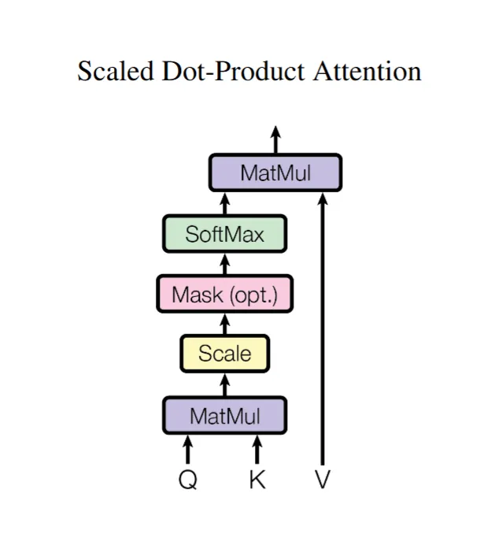

### 1. Self-Attention 
---


$$
\mathrm{Attention}(Q, K, V) = \mathrm{softmax}\left(\frac{QK^\top}{\sqrt{d_k}}\right)V
$$

基本原理：
通过线性变换将输入序列转换为查询向量（Q）、键向量（K）和值向量（V），使序列中每个位置能够关注其他位置的信息，从而捕捉序列内部的依赖关系。

计算过程：
1. 对输入序列进行线性变换，生成 Q、K、V。
2. 计算 Q 和 K 的点积，得到注意力得分矩阵。
3. 将得分矩阵除以缩放因子（键向量维度的平方根），以稳定梯度。
4. 应用 softmax 函数，将得分转换为注意力权重。
5. 将注意力权重与值向量相乘，得到输出。

```python

```

[参考链接1](https://zhuanlan.zhihu.com/p/30100853445)
[参考链接2](https://p19e99.github.io/posts/note/attention/)

### 2. CrossAttention
---


### 3. MultiHeadAttention
---


